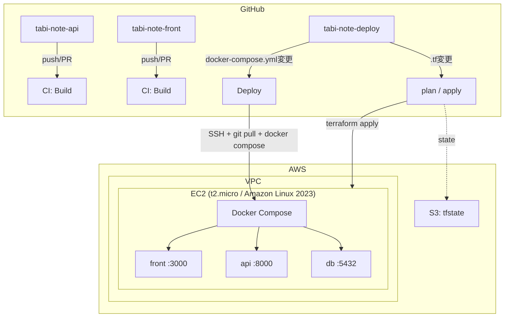
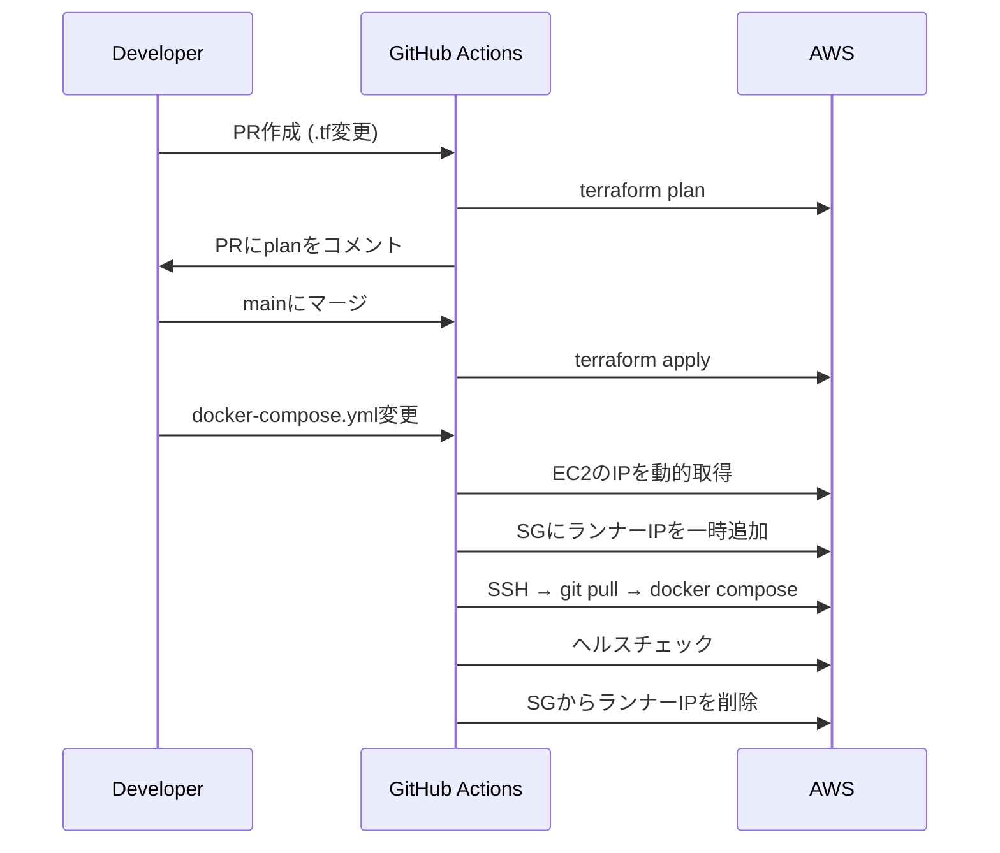

# tabi-note

旅行の記録・管理を行う Web アプリケーション。

## Tech Stack

| カテゴリ | 技術 |
|---------|------|
| Frontend | Next.js / Tailwind CSS |
| Backend | NestJS / TypeORM |
| Database | PostgreSQL |
| Infrastructure | AWS (EC2 / VPC / S3) / Terraform |
| Container | Docker / Docker Compose |
| CI/CD | GitHub Actions |

## アーキテクチャ

## インフラ構成

Terraform で以下のリソースを管理。

- **VPC** — 192.168.0.0/20
- **EC2** — t2.micro、パブリックサブネット (ca-central-1)
- **Security Group** — フロント(3000)・API(8000) を公開、SSH はデプロイ時のみ動的許可
- **S3** — Terraform state 管理

## CI/CD パイプライン

## リポジトリ構成

| リポジトリ | 内容 |
|-----------|------|
| tabi-note-deploy | Terraform / Docker Compose / GitHub Actions |
| tabi-note-api | NestJS API |
| tabi-note-front | Next.js フロントエンド |
