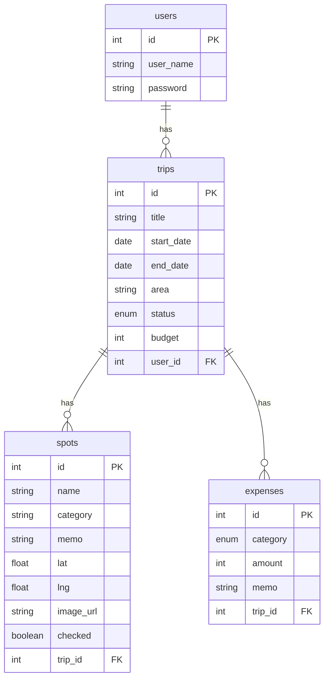

# DB設計書

## ER図

## テーブル定義

### users

| カラム名  | 型      | NULL | デフォルト     | 説明       |
| --------- | ------- | ---- | -------------- | ---------- |
| id        | int     | NO   | AUTO_INCREMENT | 主キー     |
| user_name | varchar | NO   | -              | ユーザー名 |
| password  | varchar | NO   | -              | パスワード |

### trips

| カラム名   | 型      | NULL | デフォルト     | 説明                                 |
| ---------- | ------- | ---- | -------------- | ------------------------------------ |
| id         | int     | NO   | AUTO_INCREMENT | 主キー                               |
| title      | varchar | NO   | -              | 旅行タイトル（最大100文字）          |
| start_date | date    | YES  | NULL           | 開始日                               |
| end_date   | date    | YES  | NULL           | 終了日                               |
| area       | varchar | YES  | NULL           | エリア名（最大100文字）              |
| status     | enum    | NO   | 'want'         | ステータス（'want' / 'done'）        |
| budget     | int     | YES  | NULL           | 予算（0以上）                        |
| user_id    | int     | NO   | -              | ユーザーID（FK → users.id, CASCADE） |

### spots

| カラム名  | 型      | NULL | デフォルト     | 説明                             |
| --------- | ------- | ---- | -------------- | -------------------------------- |
| id        | int     | NO   | AUTO_INCREMENT | 主キー                           |
| name      | varchar | NO   | -              | スポット名（最大100文字）        |
| category  | varchar | YES  | NULL           | カテゴリ（最大50文字）           |
| memo      | varchar | YES  | NULL           | メモ（最大500文字）              |
| lat       | float   | YES  | NULL           | 緯度                             |
| lng       | float   | YES  | NULL           | 経度                             |
| image_url | varchar | YES  | NULL           | 画像URL                          |
| checked   | boolean | NO   | false          | チェック状態                     |
| trip_id   | int     | NO   | -              | 旅行ID（FK → trips.id, CASCADE） |

### expenses

| カラム名 | 型      | NULL | デフォルト     | 説明                                                 |
| -------- | ------- | ---- | -------------- | ---------------------------------------------------- |
| id       | int     | NO   | AUTO_INCREMENT | 主キー                                               |
| category | enum    | NO   | -              | カテゴリ（'transport' / 'hotel' / 'food' / 'other'） |
| amount   | int     | NO   | -              | 金額（0〜9,999,999）                                 |
| memo     | varchar | YES  | NULL           | メモ（最大500文字）                                  |
| trip_id  | int     | NO   | -              | 旅行ID（FK → trips.id, CASCADE）                     |

## 備考

- ORM: TypeORM（`synchronize: true` で自動マイグレーション）
- DB: PostgreSQL 15
- スポット・費用はともに旅行削除時に CASCADE 削除される
- 旅行はともにユーザー削除時に CASCADE 削除される
- `password` カラムは bcrypt 等でハッシュ化して保存すること（平文保存禁止）
