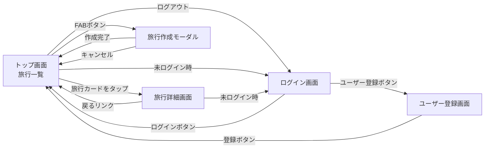

# 画面設計書

## 画面一覧

| 画面名             | パス          | 概要                     |
| ------------------ | ------------- | ------------------------ |
| トップ（旅行一覧） | `/`           | 旅行の一覧表示・新規作成 |
| ログイン           | `/login`      | ログイン                 |
| ユーザー登録       | `/signup`     | ユーザー登録             |
| 旅行詳細           | `/trips/[id]` | スポット・費用の管理     |

## 画面遷移図



---

## 画面詳細

### トップ画面（`/`）

**目的:** 旅行の一覧表示と新規作成

**レイアウト:**

```
┌──────────────────────────────────────────┐
│  旅ノート         user_nameさん 50% · 1/2件 [ログアウト] │  ← タイトル・達成率
├──────────────────────────────────────────┤
│  [ 予定 ] [ 記録 ]                        │  ← タブ
├──────────────────────────────────────────┤
│ ┌──────────────────────────────────────┐ │
│ │ 京都旅行                              │ │
│ │ 2025/3/1 〜 2025/3/3                  │ │
│ │ 京都                                   │ │
│ └───────────────────────────────────────┘ │
│                                           │
│                                       [+]  │  ← FABボタン
└─────────────────────────────────────────────┘
```

**コンポーネント:**

| コンポーネント | 役割                                                            |
| -------------- | --------------------------------------------------------------- |
| `TripListTabs` | want / done タブで旅行をフィルタリング表示                      |
| `AddTripModal` | 旅行作成モーダル（title / startDate / endDate / area / budget） |
| `LogoutButton` | ログアウトボタン                                                |

---

### ログイン画面（`/login`）

**目的:** ユーザーログイン

**レイアウト:**

```
┌─────────────────────────────┐
│  旅ノート                    │
├─────────────────────────────┤
│  ログイン                    │
├─────────────────────────────┤
│ ┌─────────────────────────┐ │
│ │ ユーザー名                │ │
│ │ [ユーザー名入力フォーム]    │ │
│ │ パスワード                │ │
│ │ [パスワード入力フォーム]    │ │
│ │ [ログインボタン][ユーザー登録ボタン]│ │
│ └─────────────────────────┘ │
│                             │
└─────────────────────────────┘
```

**コンポーネント:**

| コンポーネント | 役割           |
| -------------- | -------------- |
| `LoginButton`  | ログインボタン |

---

### ユーザー登録画面（`/signup`）

**目的:** ユーザー登録

**レイアウト:**

```
┌─────────────────────────────┐
│  旅ノート                    │
├─────────────────────────────┤
│  ユーザー登録                 │
├─────────────────────────────┤
│ ┌─────────────────────────┐ │
│ │ ユーザー名                │ │
│ │ [ユーザー名入力フォーム]    │ │
│ │ パスワード                │ │
│ │ [パスワード入力フォーム]    │ │
│ │ [登録ボタン]              │ │
│ └─────────────────────────┘ │
│                             │
└─────────────────────────────┘
```

**コンポーネント:**

| コンポーネント | 役割               |
| -------------- | ------------------ |
| `SignupButton` | ユーザー登録ボタン |

---

### 旅行詳細画面（`/trips/[id]`）

**目的:** 旅行に紐づくスポット・費用の閲覧・管理

**レイアウト:**

```
┌─────────────────────────────┐
│ ← 一覧へ                    │
│ 京都旅行                    │
│ 2025/3/1 〜 2025/3/3 · 京都  │
│ [完了にする] [削除]           │
├─────────────────────────────┤
│ スポット 1/2件チェック済み     │
│ ┌─────────────────────────┐ │
│ │ ☑ 金閣寺  観光           │ │  ← チェック済み（取り消し線）
│ │ ☐ 嵐山    観光  [編集][削]│ │
│ └─────────────────────────┘ │
│ [スポット追加フォーム]         │
├─────────────────────────────┤
│ 費用                        │
│  ● 交通  新幹線    ¥15,000   │
│  ● 宿泊  ホテル    ¥20,000   │
│ [カテゴリ別横棒グラフ]         │
│ [予算バー: ¥35,000 / ¥50,000] │
│ [費用追加フォーム]             │
└─────────────────────────────┘
```

**コンポーネント:**

| コンポーネント        | 役割                                               |
| --------------------- | -------------------------------------------------- |
| `TripActions`         | ステータス変更（want ↔ done）・旅行削除            |
| `SpotCheckButton`     | スポットのチェック状態をトグル                     |
| `EditSpotButton`      | スポット編集モーダル                               |
| `DeleteSpotButton`    | スポット削除（確認なし）                           |
| `AddSpotForm`         | スポット追加（name / category / memo / lat / lng） |
| `ExpenseSummary`      | 費用リスト・カテゴリ別グラフ・予算バー             |
| `EditExpenseButton`   | 費用編集モーダル                                   |
| `DeleteExpenseButton` | 費用削除（確認なし）                               |
| `AddExpenseForm`      | 費用追加（category / amount / memo）               |

---

## 費用カテゴリ

| 値        | 表示ラベル | カラー   |
| --------- | ---------- | -------- |
| transport | 交通       | 青系     |
| hotel     | 宿泊       | 緑系     |
| food      | 食事       | 黄系     |
| other     | その他     | グレー系 |

## 旅行ステータス

| 値   | 意味 | 操作                               |
| ---- | ---- | ---------------------------------- |
| want | 予定 | 「記録」ボタンで done に変更       |
| done | 記録 | 「予定に戻す」ボタンで want に変更 |
